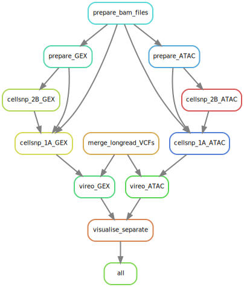

# - mulTiome demultiplexing Using Long-read SNP Information Pipeline 

Snakemake pipeline to demultiplex 10x multiome data utilizing SNP calls from WGS sequencing of pooled patients.

The Pipeline uses CellSNP-lite & Vireo 

More information on CellSNP-lite can be found at the following citation:
> Xianjie Huang, Yuanhua Huang, Cellsnp-lite: an efficient tool for genotyping single cells, Bioinformatics, Volume 37, Issue 23, December 2021, Pages 4569–4571, https://doi.org/10.1093/bioinformatics/btab358 

More information on Vireo can be found at the following citation
> Huang, Y., McCarthy, D.J. & Stegle, O. Vireo: Bayesian demultiplexing of pooled single-cell RNA-seq data without genotype reference. Genome Biol 20, 273 (2019). https://doi.org/10.1186/s13059-019-1865-2

 __This pipeline is a work in progress!__

## Preprocessing & data structure 
1) All our data is present and analysis are run on the HPC infrastructure from the VSC (Flemish Supercomputer Centrum, https://www.vscentrum.be/)
2) A typical experiment performed by us has the following structure:
   - 1 Multiome-run ("MOC" in configfile) of 8 separate reaction lanes consists our of 2 pools ("Pool_number" in configfile, usually named 1 and 2)
   - Each subpool normally uses 4 lanes (named A,B,C or D, automatically detected by pipeline)
   - Each of these 4 lanes containes the same mix of patients. This is why the data of these 4 lanes are combined in the pipeline
3) 10X Genomics Cellranger-ARC pipeline and demultiplexing pipeline should use the same reference genome
   - if this is not the case/not possible: use a liftover program (not tested)
   - To use the T2T reference genome: There is no standard reference available from 10X genomics. You can create one using 10X Cellranger-ARC mkref
   - See separate github: [T2T Github](https://github.com/voetlab/)
4) Fastq files are generated by 10X Cellranger-arc mkfastq using default parameters
5) Further analysis uses 10X Genomics Cellranger-arc count with the in-house generated T2T reference genome (see above and separate github entry)
   - the output of 10X Genomics cellranger-arc count is referenced in the configfile as: "Cellranger_output"
6) Long read data is analyzed using the NanoWGS pipeline (https://github.com/AlexanRNA/nanowgs)
   - .pileup.vcf.gz output from clair3 from all patients is moved 1 folder. This is referenced in the configfile as: "vcf_file_path"
   - A samplesheet is generated by listing all patients present per Pool. This is referenced in the configfile as: "LongRead_vcf_list"

## Overview of the pipeline

The Snakemake pipeline consists out of the following steps:
1) copy over barcodefile and both GEX & ATAC bam files from 10x Cellranger Multiome output
   - add subpool specific tag to barcode
2) preprocessing of bam files:
   -  Add subpool specific tag to barcode of each read in each bamfile
   -  Merge bamfiles of different subpools (containing the same patients)
   -  index merged GEX & merged ATAC bamfile 
3) merge VCF files from the different patients in the pool
4) run Cellsnp-lite mode 2B in a bulk manner on the GEX & ATAC seperate
5) run Cellsnp-lite mode 1A in combination with the reference from the merged VCF file
6) run Vireo on ATAC & GEX separately to demultiplex the cells
7) visualize the overlap of the 2 modalities and create an output matrix containing the cellbarcode & the patient this barcode belongs to 



## Download
```
git clone https://github.com/voetlab/Multiome_Demultiplexing_WGS
```
## Usage
To run the Snakemake pipeline, first adapt the parameters and filepaths in the config.yaml file according to your experiment and HPC setup.

Download all packages needed and set the path in the 'exec' tab of the pipeline. Make sure Snakemake is also present to run the pipeline together with the R packages needed in the pipeline: 
   - ggplot2
   - dplyr
   - Matrix
   - tidyr
   - tibble
   - plotly

The pipeline is ran using Snakemake:
```
snakemake --cores 36 --rerun-incomplete
```
This is the case if the configfile and the Snakefile are in the same location. If this is the case, uncomment the first line of the Snakefile and enter the exact name of the configfile here.

However, I find it easier to store the Snakefile & source folder in a separate location than the configfile. If this is the case, you can run the pipeline like this, and specify the location of both the Snakefile & configfile.

```
snakemake --snakefile /staging/leuven/stg_00055/projects/ASAP/Multiome/Demultiplexing/Snakefile  --configfile /staging/leuven/stg_00055/projects/ASAP/Multiome/Demultiplexing/MOC11/config_Pool1.yaml  --cores 36 --rerun-incomplete
```

As the pipeline will take quite some time to complete (bottleneck at the moment the addition of the tag to the barcodes in the bamfiles), its best to run it like this in a screen. 

Another way to run the pipeline is using a scheduler like e.g. SBATCH. An examplescript using the second approach can be found here: [Slurm script](runsnakemake.slurm). This script can be executed e.g. like: 
``` 
sbatch --cluster=wice  -C icelake --switches=1 --partition=dedicated_big_bigmem -A lp_big_wice_cpu runsnakemake.slurm
```

### Configfile Explained

parameter:
  - amount_of_patients_in_subpool = Amount of different patients multiplexed in the 10X genomics multiome run. Doesn’t have to be the same as the number of patients mentioned in the samplesheet e.g.8
  - pool_number = subpool number if present. e.g. 1
  - minMAF = minimum minor allele frequency. is used for SNP filtering. e.g. 0.1
  - minCOUNT = minimum aggregated UMI/Read counts. Used for SNP filtering. e.g. 20
  - MOC = identifier of the sample. e.g. MOC11

path:

  - Cellranger_output: Path to 10X Genomics cellranger-arc count output folder  
  - LongRead_vcf_list: Path to samplesheet containing all the patientIDs of the samples in the specific MOC pool
  - results: Path to outputfolder. A new folder with structure MOCXX/PoolX will be automatically made by the pipeline
  - temp: Path to temporary folder. This can be removed after the pipeline finished successfully
  - scripts: Path to folder where all scripts needed are stored
  - vcf_file_path: Path to folder where all Clair3 outputs are stored

exec:
  - vireo: Path to vireo executable. e.g. /staging/leuven/stg_00055/miniconda3/envs/vireo/bin/vireo
  - cellsnp-lite: Path to cellsnp-lite executable. e.g./staging/leuven/stg_00055/miniconda3/envs/vireo/bin/cellsnp-lite
  - bcftools: Path to bcftools executable. e.g./staging/leuven/stg_00055/miniconda3/envs/vireo/bin/bcftools
  - python: Path to Python executable. e.g./staging/leuven/stg_00055/miniconda3/envs/VoetEnv/bin/python
  - samtools: Path to Samtools executable. e.g./staging/leuven/stg_00055/miniconda3/envs/ASAP/bin/samtools
  - Rscript: Path to Rscript executable. e.g./staging/leuven/stg_00055/miniconda3/envs/ASAP/bin/Rscript

## Contact
Created by [Jarne Geurts](jarne.geurts@kuleuven.be), Laboratory of Reproductive Genomics (Prof. T. Voet), Department of Human Genetics, KU Leuven

## Citations:
10.5281/zenodo.13619680 
